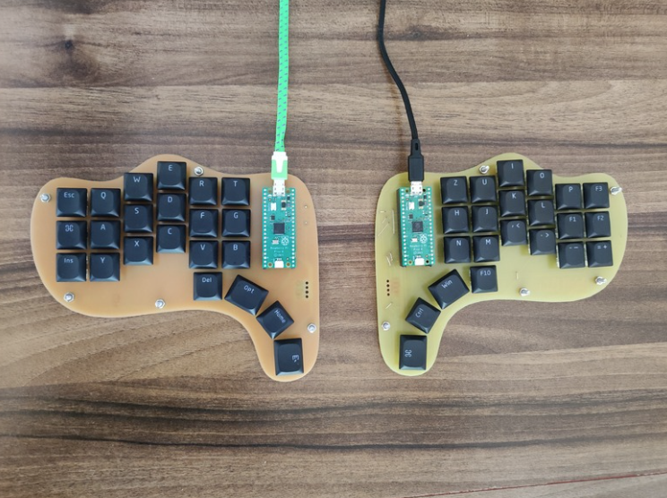

# PinkyPi
Ortho Staggered ergo split keyboard using Raspberry Pi Pico \
\
 \
\

# Flash CircuitPython firmware:
0. Connect Pico to PC while holding down the "Bootsel" button
1. Open Thonny
2. Go to: Tools -> Options -> Interpreter
3. Choose CircuitPython (RP2040)
4. Click on "Install or update CircuitPython"
5. Rest is self-explanatory, firmware version 9.0.5 is recommended (code is only tested on this version)

# Run the keyboard code:
1. Flash CircuitPython firmware
2. copy "lib" folder of this repo to the Picos internal storage
3. Open Thonny
4. Execute the actual .py code file
5. (rename file to main if it should run automatically on Pico startup)
